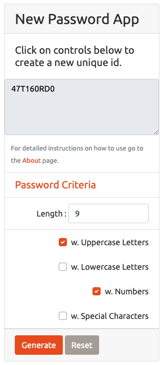

# 03 JavaScript: Password Generator.

Create an application that will generate a random password, based on user-selected criteria in order to exercise key javascript concepts like programing logic, flow control, JS linkage to HTML, accessing DOM elements through JS, etc.

## 1. Guidelines

User Story and Acceptance Criteria were provided in the original `README.md` along with starter code and a sample UI in order to get a better sense of what was the target objective of the assignment. All of this input was taken into account when deciding the actual implementation route. Listed below is a review of the input provided for the assignment.

### 1.1. Provided User Story.

AS AN employee with access to sensitive data,
I WANT to randomly generate a password that meets certain criteria,
SO THAT I can create a strong password that provides greater security.

### 1.2. Acceptance Criteria Checklist.

The following section takes the requirements provided in the homework assignment and we do a step by step crosscheck of each of the acceptance criterias while also providing feedback and explanations of each of the development decisions made. 

#### 1.2.1 Initial Criteria.

* Create an application that generates a random password based on user-selected criteria. 
- [x] Done --- Issac.

* This app will run in the browser and feature dynamically updated HTML and CSS powered by your JavaScript code. It will also feature a clean and polished user interface and be responsive, ensuring that it adapts to multiple screen sizes. 
- [x] Done --- Issac.

#### 1.2.2. Detailed Acceptance Criteria.

GIVEN I need a new, secure password:

* WHEN I click the button to generate a password, THEN I am presented with a series of prompts for password criteria. 
- [x] Criteria is displayed in the main UI instead of using basic javascript prompts. --- Issac.

* WHEN prompted for password criteria, THEN I select which criteria to include in the password. 
- [x] Checkboxes provided in the UI provide a more intuitive usage for the user when selecting which criteria to include. --- Issac.

* WHEN prompted for the length of the password, THEN I choose a length of at least 8 characters and no more than 128 characters. 
- [x] Validation logic is implemented --- Issac.

* WHEN prompted for character types to include in the password, THEN I choose lowercase, uppercase, numeric, and/or special characters. 
- [x] These options are provided in the UI through checkbox controls. --- Issac.

* WHEN I answer each prompt, THEN my input should be validated and at least one character type should be selected. 
- [x] Validation logic is implemented in order to ensure that at least one criteria is selected. --- Issac.

* WHEN all prompts are answered, THEN a password is generated that matches the selected criteria. 
- [x] Clicking on `Generate` button control does the following: --- Issac.
    1. Validation logic confirms that user input is as expected. 
    2. If validation logic `IS` satisfied a new password is providede the main screen text box area. 
    3. If validation logic is `NOT` satisfied a specific error message is displayed. 

* WHEN the password is generated, THEN the password is either displayed in an alert or written to the page. 
- [x] Password is presented in `index.HTML` password area text box. --- Issac.

### 1.3. Deliverables.

* The URL of the deployed application.
- [x] https://carlosissac.github.io/mod03hwpswdgen/ --- Issac.

* The URL of the GitHub repository. Give the repository a unique name and include a README describing the project.
- [x] https://github.com/carlosissac/mod03hwpswdgen. Name of the repo is `mod03hwpswdgen`, a new `README.md` detailing the development process is also provided and displayed. --- Issac

## 2. Features and Comments.

The following section details the development decisions and implementation routes taken for this assignment.

## 2.1. UI Design.

* Starter code was not used. Everything was built from scratch.

* App has an `index.HTML` where the main password functionality is shown, and an `about.HTML` page where detailed instructions on how to use the app are provided and supporting links are included as well.

* Purpose of including an image and an About page was to ensure that a responsive and functional layout was successfully implemented. This was verified by using different screen sizes and responsive mode in Chrome browser's DevTools.

* Positioning, Layout, text and design were all intentional. 

* Navbar has functioning links, and working Hamburger button.

* Brand button redirects to `index.HTML`.

* Image has an embedded live link to my personal social media.

* Sticky footer was implemented.

* Additional styling fonts were successfully linked. The folloing URL was used https://use.fontawesome.com/releases/v5.10.1/css/all.css.

* The following bootstrap theme was successfully linked https://bootswatch.com/united/.

* Below is an app snapshot detailing the main functionality screen.

## 2.3. HTML and CSS.

* Semantic HTML was used and Alt Tags were included in images.

* Each page has valid and correct HTML. In order to assure compliance the following validator was utilized: https://validator.w3.org/nu/. No errors are found in the final version.

* `style.CSS` file is available in the Assets folder and was successfully linked to both `index.HTML` and `about.HTML`.

* `Generate` and `Reset` buttons redirect the focus to the main banner of the UI (this functionality is more noticeable on small or mobile screens). At first we redirected to the Password Area Text Box control, but during usage this was not aesthetically appealing. After redirecting focus to main UI banner this was functionally and aesthetically better.

* The site has working media queries that help with the padding configuration in smaller screen sizes.

* Layout distribution was not entirely satisfactory for Ipad and IpadPro sizes. This will require further tinkering.

* The following links were attached in order to assure hamburger button functionality. 
    * https://code.jquery.com/jquery-3.4.1.slim.min.js.
    * https://stackpath.bootstrapcdn.com/bootstrap/4.4.1/js/bootstrap.bundle.min.js. 
    * https://stackpath.bootstrapcdn.com/bootstrap/4.4.1/js/bootstrap.min.js.

## 2.4. JS code.

* File `script.JS` was provided inside the Assets folder. I'm not entirely sure if this is good practice. Please provide some advice on this.

* Steps required in order to complete the password generation process were pseudo coded before any JS Code was written.

* Object oriented design and basic functions was also whiteboarded before any coding actually took place.

* Query selectors were coded first in order to map components from HTML UI into `script.JS`.

* Afterwards event listeners were deployed, in order to link Generate and Reset button click actions to `genPsswd()` and `resetForm()` functions respectively..

* Random character generating functions implementation were taken from the following external example https://www.youtube.com/watch?v=duNmhKgtcsI. More specifically I based the approach of providing a random character based on a range of numbers that matched the range of the browser character codes for the specific password criteria (uppercase, lowercase and numbers) from this example.

* Password special characters were generated by using the following article provided by the assigment https://www.owasp.org/index.php/Password_special_characters.

* When trying to use the quotation character `"` a back forward slash `\` had to be appended next to it in order to bypass JS reserved word status for quotation character.

## 2.5 Extra Challenge.

* After demoing the application to one of my developer friends (https://github.com/franknunez23). I was asked for an additional challenge. 

* Challenge consisted in the following:
    1. After the password is successfully provided by the app.
    2. User will tap or click on the password area text box to copy to clipboard.
    3. An alert must show up notifying the user that the password is copied to clipboard.

* Challenge was one upped by myself the following way:
    1. Making sure that you will only be able get the alert confirmation and consequently `ONLY` be able to copy to the clipboard when a password is successfully delivered, `NOT` when an error message is displayed or placeholder text is showing in the UI.

## 3. Conclusions.

Object oriendted design should be the first thing to be taken into account when moving forward with implementation. This will pay off significant dividends as we move forward through development and will make our separation of concerns easier to estimate, consequently our code will be easier to oragnize, build and test. 

## 4. Appreciations.

* Maryus Martsyalis.
* Colin McPike.
* Beki Gonzales.
* Mark Kelly.
* Keith Billings.
* Frank Nunez